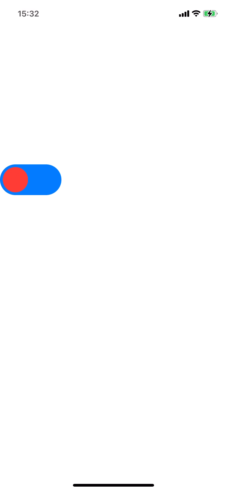

# FYDraggableView

## Requirements

- iOS 11.0 +

## Installation

### Cocoapods

In your `Podfile`

```
pod 'FYDraggableView'
```

Get busy Dragging

```objc
#import "UIView+FYDraggable.h"
```

## Usage

### Basic

```objc
- (instancetype)initWithFrame:(CGRect)frame
{
    if (self = [super initWithFrame:frame]) {
        self.fy_draggable = YES;
        self.fy_draggablePanGestureRecognizerView = self; // default
    }
    return self;
}
```

You can provide your personal configuration

```objc
FYDraggableViewConfiguration *configuration = [FYDraggableViewConfiguration configurationWithDirection:FYDraggableViewDirectionAll
                                                                                              position:FYDraggableViewPositionLeft];
configuration.recognizerContentInsets = UIEdgeInsetsMake(5, 5, 5, 10);
configuration.extraContentInsets = UIEdgeInsetsMake(0, 0, 0, -56);
self.fy_draggableViewConfiguration = configuration;
```

### Delegate Methods

```objc
self.fy_draggableViewDelegate = self;
```

```objc
- (void)fy_draggableViewDidDrag:(UIView *)view;

- (void)fy_draggableViewWillBeginDragging:(UIView *)view;
- (void)fy_draggableViewWillEndDragging:(UIView *)view targetCenter:(inout CGPoint)targetCenter;
- (void)fy_draggableViewDidEndDragging:(UIView *)view willDecelerate:(BOOL)decelerate;

- (void)fy_draggableViewWillBeginDecelerating:(UIView *)view;
- (void)fy_draggableViewDidEndDecelerating:(UIView *)view;
```

## Demo

<div align="center">
	
</div>
